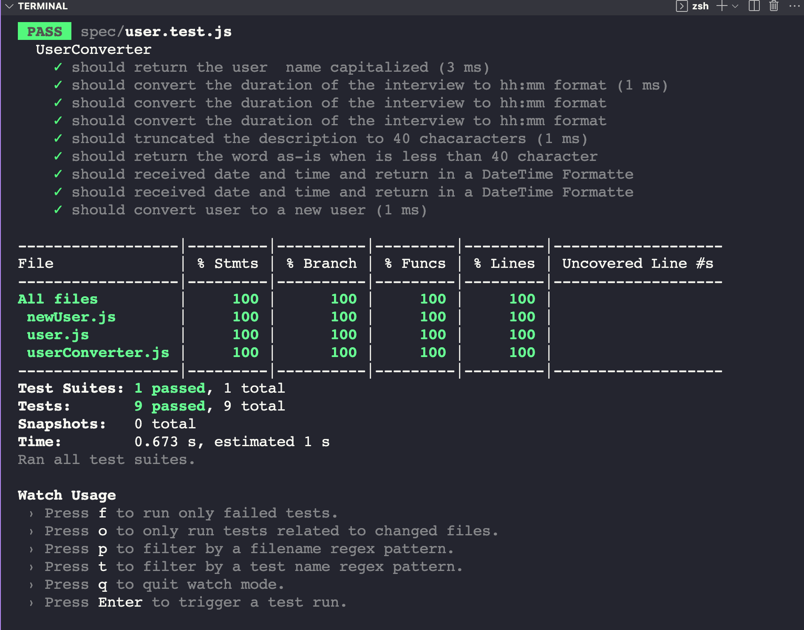

# tdd-data-migration
# Feature: New Platform Data Migration
    As a user, 
    I want to see my data in the new format
    So that I can interact with my data in a more user-friendly way.

# Scenario: Successfully converting a user's data
    Given I have a user's data in the old platform's format
    When I pass the data through the userConverter
    Then I should get the data in the new platform's format

# Example:
    Given the following user data:
    """
    {
        "name": "james stuart",
        "durationInMinutes": 60,
        "description": "The candidate showed apprehension when asked about his academic history",
        "startDate": "2022-07-20",
        "startTime": "13:00",
        "endDate": "2022-07-20",
        "endTime": "13:30"
    }
    """
    When I pass this data through the userConverter
    Then I should get the following transformed data:
    """
    {
        "name": "James Stuart",
        "duration": "01:00",
        "description": "The candidate showed apprehension when asked about his academic history",
        "startDateTime": "2022-07-20T13:00",
        "endDateTime": "2022-07-20T13:30"
    }
    """

# Coverage: 

